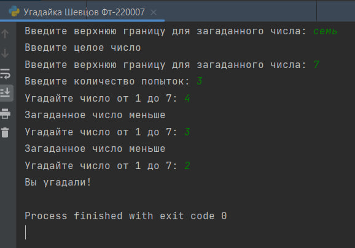
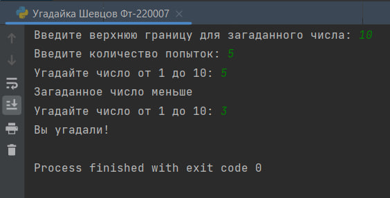
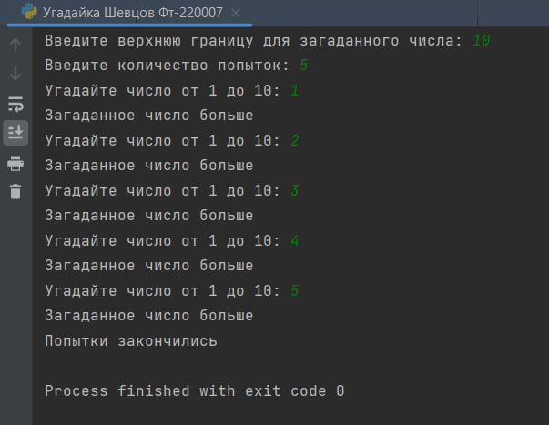

# Исполнитель
Шевцов Михаил
Фт-220007

# Лабораторная работа №10 - Угадайка
Компьютер загадывает число от 1 до N. У пользователя k попыток отгадать. После каждой неудачной попытки компьютер сообщает меньше или больше загаданное число. В конце игры программа выводит текст с результатом (или «Вы угадали!», или «Попытки закончились»).

# Среда разработки
Язык программирования Python
Среда разработки PyCharm Edu 2022.2.2

# Инструкция по работе
Чтобы запустить программу, нужно открыть файл с названием “Угадайка Шевцов Фт-220007.py” в любом компиляторе кода, поддерживающем язык Python, начать тест и следовать указаниям программы.

## Тесты
Тест N=7; k=3
___

___
Тест N=10; k=5
___

___
Тест N=10; k=5; Попытки закончились
___

